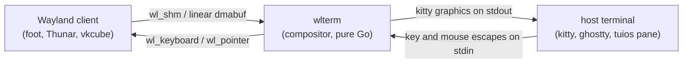

# wlterm

A Wayland compositor that runs inside a terminal.

wlterm binds its own Wayland socket and real clients connect to it: foot,
kitty, Thunar, vkcube. They render into shared memory or a linear dmabuf.
wlterm composites the frames and writes the pixels to its own stdout as
kitty graphics escapes, so your terminal draws them. Keyboard and mouse
escapes flow the other way and come back out as `wl_keyboard` and
`wl_pointer` events.

Pure Go. No cgo, no libwayland, no wlroots, no EGL. The wire protocol is
hand-implemented.


This recording is one terminal. wlterm is compositing a kitty that runs
tuios. Inside that tuios pane, `./inner.sh` starts a second wlterm, which
composites a second kitty running a second tuios. Every level is a real
compositor presenting to a real terminal.

## Try it

```sh
go build -o wlterm .
./wlterm -- foot            # a Wayland terminal inside your terminal
./wlterm -- vkcube          # Vulkan, inside your terminal
./wlterm -multi -- foot     # a tiling compositor with a dock and a launcher
```

You need a terminal that renders kitty graphics: kitty, ghostty, WezTerm.
Inside a multiplexer, the pane works when the host terminal underneath
supports them and the multiplexer passes them through; tuios does.

## How it works



- wlterm listens on its own socket (`wlterm-<pid>` under a private runtime
  dir). It never dials or advertises the host session's `WAYLAND_DISPLAY`.
- At startup it probes the terminal for the pane's size in pixels and cells,
  and re-probes on `SIGWINCH`, so clients always see the pane's real
  geometry.
- Client buffers reach wlterm as plain memory: `wl_shm` pools are mmapped,
  and dmabufs are restricted to `DRM_FORMAT_MOD_LINEAR` so reading them back
  is the same `mmap` and `memcpy`. No GPU readback path exists or is needed.

## Single-app mode (the default)

One toplevel, filling the pane, and nothing else. This is the mode for
running a Wayland program inside a multiplexer, because the multiplexer
already draws the border and the title and already owns the leader key.

- No chrome. wlterm draws no frame, no title, no dock. The client gets the
  pane's exact pixel size; tiling mode would round it to whole cells.
- No leader key. Every keystroke goes to the app.
- Resizes with the pane, exits when the app exits, and exits on
  `SIGHUP`/`SIGTERM`, so closing the pane closes it.

The escape hatch is `ctrl+\` tapped twice inside 700ms. A single press still
reaches the app. `-quit-key ctrl+q` picks a different key; `-quit-key none`
intercepts nothing.

## Multi mode

`-multi` turns on the tiling compositor: BSP and master-stack layouts, a
frame and title per window, a dock, a leader key (`-prefix`, default
`ctrl+b`), and an application launcher.


The launcher (`ctrl+b d`) fuzzy-matches over the system's desktop entries
and ranks them by use. Launched GUI apps are verified against the
framebuffer: if a window never appears, the log says so.


## Transports

wlterm has three ways to put pixels on your terminal, and `-mode auto`
(the default) picks one:

- `shm`: frames go into a small ring of `/dev/shm` files and the escape
  carries a filename. The pty carries about 80 bytes per frame and the
  pixels ride tmpfs. Correct everywhere, and the fallback for everything
  below.
- `delta`: kitty animation frames (`a=f`) patch the image already on screen,
  so only the damage moves. A small update is about 80 bytes of escape and a
  rectangle of pixels instead of a whole frame.
- `b64`: whole frames, base64, inline. Works anywhere kitty graphics work
  and costs the most, megabytes down the pty per frame.

Whether delta is safe is the whole question, and the environment never
answers it. `KITTY_WINDOW_ID` is inherited straight through a pane, and
tuios forwards the host's `TERM` into it rather than replacing it, so both
name the host terminal and neither says anything about the pane in front of
it. The old heuristic read them and picked delta exactly where it could not
work. So auto asks instead:

- With no multiplexer, wlterm asks the terminal, with a probe a terminal
  that gets frame edits wrong has to fail. It patches one pixel of a
  four-pixel image and then checks the image is still four pixels wide, and
  separately checks that a frame wider than the image is refused. A plain OK
  is not enough to pass. kitty passes; ghostty and WezTerm answer neither
  half, which is the right answer, because neither implements frame edits.
- Inside tuios, wlterm asks tuios. tuios forwards a guest's `a=f` to its own
  host and exports the result as `TUIOS_KITTY_ANIMATION`. It has to be asked
  rather than probed, because tuios does not relay the host's reply back
  into the pane: a guest that sends a frame edit and waits hears nothing
  whether it worked or not. A tuios old enough not to set the variable gets
  shm, which is what it got before.
- Inside tmux, zellij or screen, shm. None of them carry frame edits.

When auto chooses delta it keeps a ceiling of 200 frames a second whatever
`-fps` asks for. An explicit `-mode delta` does not, so `-fps` stays the
measured promise it is elsewhere.
Frame edits are cheap enough to remove wlterm's own brake and nothing
downstream supplies another one, so uncapped it outruns the terminal:
measured against a software-rendered kitty at 700x350, 150 and 200 fps both
kept the picture moving, 260 dropped more than half of it, and uncapped left
the terminal presenting nothing at all for twenty seconds. The same workload
in shm mode never gets there, because copying the frame is its own brake and
it tops out near 130.

### What the transports cost

One guest (`wlbench`), one canvas, `-fps 60` for all of them so the CPU
columns are measuring the same number of frames, twelve seconds each,
`tools/afbench.py`. `rect` moves a 128x128 box; `full` repaints everything.
`bare` is kitty directly at 1530x800; `tuios` is the same kitty with a tuios
pane in between at 747x320, so the two blocks are only comparable within
themselves.

Inside a tuios pane:

| transport | damage | pty B/frame | pixels/frame | wlterm CPU | tuios CPU | kitty CPU |
|---|---|---|---|---|---|---|
| shm | rect | 82 | 934 KB | 4.5 s | 2.1 s | 58.9 s |
| delta | rect | 83 | **81 KB** | **3.8 s** | 2.1 s | 59.1 s |
| b64 | rect | 1 277 739 | 0 | 5.8 s | 23.5 s | 61.6 s |
| shm | full | 82 | 934 KB | 4.5 s | 2.1 s | 58.1 s |
| delta | full | 80 | 934 KB | 4.5 s | 2.2 s | 59.5 s |
| b64 | full | 1 277 926 | 0 | 6.0 s | 21.7 s | 58.8 s |

Bare, for the same reading at a larger canvas: `rect` costs shm 4782 KB a
frame and delta 110 KB; `full` costs both 4781 KB. b64 puts 6.5 MB a frame
down the pty and cannot hold 60 fps at all, reaching 18. Inside the pane it
reaches 44.

Three things to read off this, and only the first is good news:

- **Delta is worth it for small damage, and only for that.** It moves an
  order of magnitude fewer pixels for a moving box, and a sixth less CPU in
  wlterm. Grow the damage to the whole surface and every column matches shm,
  because a whole-image frame edit is a whole image.
- **The terminal does not get cheaper.** kitty burns the same CPU whichever
  of the two it is given. The saving is in the pipe and in the compositor,
  not at the far end, and it does not raise the frame rate: both hold the
  cap.
- **"81 bytes instead of megabytes" was delta against b64, not against
  shm.** shm already puts about 80 bytes a frame on the pty. Against shm the
  difference is where the pixels go, not how many bytes cross the wire.

b64 is the row that makes the case for either of the others, and inside a
pane it is also the row that costs tuios eleven times the CPU, because tuios
has to diff and patch every whole bitmap it is handed.

## GPU clients


That cube is Vulkan on the Intel GPU, presented through
`zwp_linux_dmabuf_v1`. wlterm advertises exactly one modifier,
`DRM_FORMAT_MOD_LINEAR`. A linear buffer on an integrated GPU is ordinary
cacheable system memory, so compositing it costs one `memcpy` and no EGL
context anywhere. Buffers with any other modifier are refused and clients
fall back to `wl_shm`.

Vulkan needs no Vulkan-specific code: Mesa's WSI allocates a dmabuf like any
other client, and LINEAR is the only offer on the table.

Measured inside a real tuios pane at 980x440, kitty rendering the same
workload for 30s, uncapped (`./run_pane.sh`):

|  | llvmpipe via `wl_shm` | i915 via linear dmabuf |
|---|---|---|
| fps | 109.6 | 213.9 |
| pane process tree CPU | 144.4 s | 46.6 s |
| guest CPU | 119.7 s | 9.2 s |

Twice the frame rate on a third of the CPU.

The render node matters. wlterm prefers a node whose driver hands out
CPU-cacheable buffers (`i915`, `xe`, `amdgpu`) and warns when the first
large read runs below 1 GB/s. NVIDIA is a hard no: on this machine the
nvidia node mmaps fine and then reads at 0.015 GB/s, which is 242ms for one
720p frame. `-drm NODE` overrides the choice; `-no-dmabuf` turns the
protocol off.

## Performance

The frame cap defaults to 120, and `-fps 0` uncaps. Sixty is a monitor's
number and nothing in this chain is a monitor: tuios coalesces a pane about
every 8ms and kitty repaints at its 10ms `repaint_delay`, so a cap of 60
throws away smoothness the host would have displayed.

The cap is honoured to the tenth of a frame. It once was not: the loop
paced on the gap after each frame instead of on a rate, so `-fps 60`
delivered 46, and the number was invisible because every benchmark ran at
`-fps 1000` where the error drowns. `wlbench/` exists so that `-fps N` is a
measured promise: run it and N has to come back.

Where a frame goes, uncapped in a tuios pane at 980x440 on the i915
(213.9 fps):

| stage | time | what it is |
|---|---|---|
| idle | 2646 us | the guest rendering; wlterm waiting |
| composite | 1489 us | blending the tile onto the canvas |
| encode | 740 us | pixels into a `/dev/shm` slot |
| write | 19 us | ~46 bytes of escape down the pty |

The compositor's own work is 2.2ms per frame. The guest is what it waits
for, which is the right shape: a compositor should be cheaper than the
thing it composites.

Nothing downstream throttles this. Counting the escapes tuios forwards to
the host terminal gives exactly two per frame at every rate tried, for 0.01
to 0.03 MB/s on the pty. The pixels ride tmpfs; only filenames cross the
wire.

## Flags

| flag | meaning |
|---|---|
| `-multi` | multi-surface tiling mode (default: single app) |
| `-quit-key` | escape hatch, tapped twice; `none` intercepts nothing |
| `-mode` | `auto` \| `delta` \| `shm` \| `b64` transport |
| `-layers` | `per-window` \| `single` image granularity |
| `-fps` | frame cap, `0` for uncapped (default 120; auto-chosen delta caps at 200) |
| `-no-dmabuf` | do not advertise `zwp_linux_dmabuf_v1` |
| `-drm NODE` | render node to advertise as dmabuf `main_device` |
| `-prefix` | leader key, `-multi` only (default `ctrl+b`) |
| `-spawn` / `-term` | commands the launcher uses, `-multi` only |
| `-exec CMD` | extra client at startup, repeatable |
| `-isolate` | private runtime dir and session bus per child (default on) |
| `-pixels` / `-cell` | headless: no tty setup, fixed canvas |
| `-snapshots DIR` | write composited PNGs for verification |

## Safety

wlterm crashed a desktop session once, early on. The rules come from that.

- The socket is wlterm's own, under a private runtime dir. The host
  session's `WAYLAND_DISPLAY` is never inherited by children and never
  dialed.
- Children get a private `XDG_RUNTIME_DIR` and a private session bus.
  Stripping `WAYLAND_DISPLAY` alone is not enough: GTK and KDE apps launch
  through the session bus, which routes the request to the copy already
  running on the host desktop, opens a window there, and exits 0 looking
  like a success.
- Client buffers are treated as hostile. Pools and dmabuf fds are validated
  before mapping, reads are bounds-checked and run under
  `debug.SetPanicOnFault`, because a client can truncate a pool after
  validation.
- Outbound frames use a fixed 8-slot ring of `/dev/shm` files, unlinked on
  reuse and on every exit path, so a terminal that never unlinks cannot
  make wlterm leak tmpfs at frame rate.

## Verifying

- `./run_pane.sh` runs everything inside a real tuios pane and prints the
  numbers above.
- `./run_safety.sh` and `dmaevil/` throw hostile clients at the compositor.
  Every case must end with the client refused and the compositor alive.
- `kittydec/` decodes wlterm's own output stream back into PNGs to
  prove a frame actually rendered.
- `wlbench/` is a minimal animating client for measuring the frame cap.
  `-work band -damage PCT` sweeps the share of the image one frame changes.
- `tools/tuios_host.py` runs tuios on a pty inside a real terminal and
  relays both directions, so tuios probes the real host and its graphics
  passthrough reaches the real host's decoder. `tools/tuios_pane.py` is the
  other half of the pair: it makes the pane real and the host fake.
- `tools/afbench.py` runs the transports against a real kitty, bare and
  under tuios, and prints what each one costs.
- `-snapshots DIR` writes composited PNGs straight out of the canvas.

## Known gaps

Client cursors are dropped, so the pointer works but is invisible. The
clipboard is a stub. The keyboard map is US layout only.
