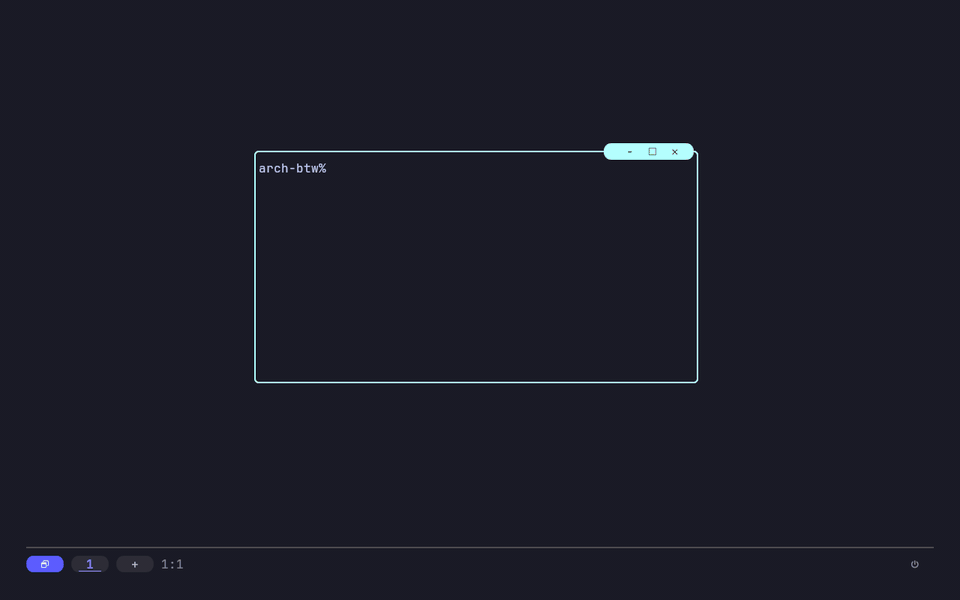
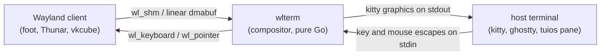
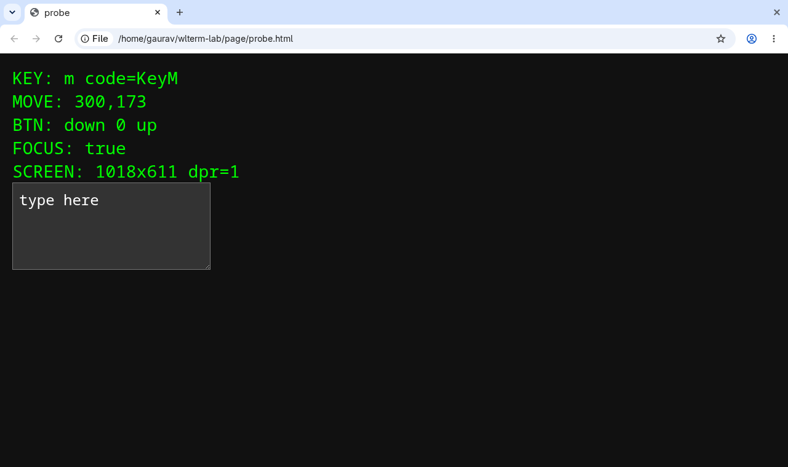
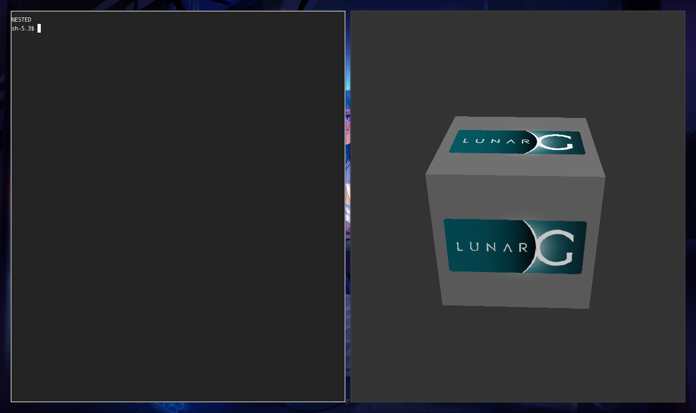
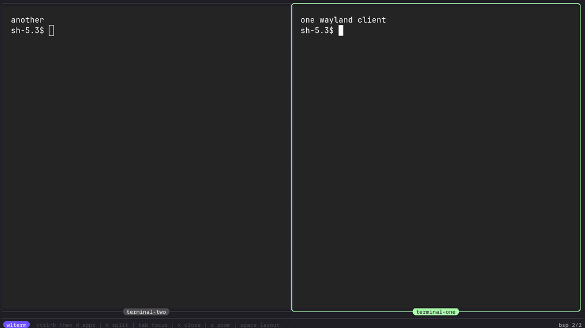
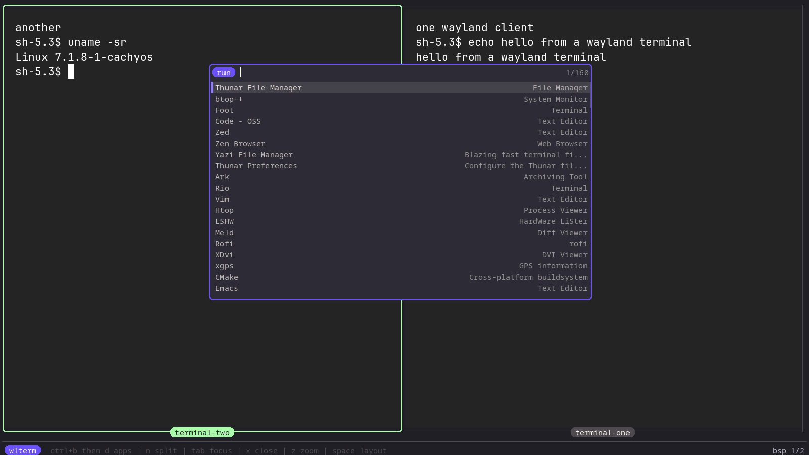
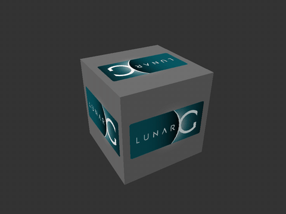

# wlterm

A Wayland compositor that runs inside a terminal.

wlterm binds its own Wayland socket and real clients connect to it: foot,
kitty, Thunar, vkcube. They render into shared memory or a linear dmabuf.
wlterm composites the frames and writes the pixels to its own stdout as
kitty graphics escapes, so your terminal draws them. Keyboard and mouse
escapes flow the other way and come back out as `wl_keyboard` and
`wl_pointer` events.

Pure Go. No cgo, no libwayland, no wlroots, no EGL. The wire protocol is
hand-implemented.



This recording is one terminal. wlterm is compositing a kitty that runs
tuios. Inside that tuios pane, `./inner.sh` starts a second wlterm, which
composites a second kitty running a second tuios. Every level is a real
compositor presenting to a real terminal.

## Try it

```sh
go build -o wlterm .
./wlterm -- foot            # a Wayland terminal inside your terminal
./wlterm -- vkcube          # Vulkan, inside your terminal
./wlterm -multi -- foot     # a tiling compositor with a dock and a launcher
```

You need a terminal that renders kitty graphics: kitty, ghostty, WezTerm.
Inside a multiplexer, the pane works when the host terminal underneath
supports them and the multiplexer passes them through; tuios does.

## How it works



- wlterm listens on its own socket (`wlterm-<pid>` under a private runtime
  dir). It never dials or advertises the host session's `WAYLAND_DISPLAY`.
- At startup it probes the terminal for the pane's size in pixels and cells,
  and re-probes on `SIGWINCH`, so clients always see the pane's real
  geometry.
- Client buffers reach wlterm as plain memory: `wl_shm` pools are mmapped,
  and dmabufs are restricted to `DRM_FORMAT_MOD_LINEAR` so reading them back
  is the same `mmap` and `memcpy`. No GPU readback path exists or is needed.

## Single-app mode (the default)

One toplevel, filling the pane, and nothing else. This is the mode for
running a Wayland program inside a multiplexer, because the multiplexer
already draws the border and the title and already owns the leader key.

- No chrome. wlterm draws no frame, no title, no dock. The client gets the
  pane's exact pixel size; tiling mode would round it to whole cells.
- No leader key. Every keystroke goes to the app.
- Resizes with the pane, and exits on `SIGHUP`/`SIGTERM`, so closing the
  pane closes it.
- Exits when the last window closes, not when the process exits. Most
  desktop launchers (`code`, `thunar`, `nautilus`) start the real program
  and return in about a second, so exiting with the process killed the
  application a moment after it appeared. If nothing has been drawn yet it
  waits 10 seconds for a window before giving up.
- A dialog floats. The application keeps the pane and the window it opens
  sits over it, centred, at the size it drew itself. Extra toplevels used to
  replace the application, so a browser asking for a keyring password
  replaced itself with the prompt.

The escape hatch is `ctrl+\` tapped twice inside 700ms. A single press still
reaches the app. `-quit-key ctrl+q` picks a different key; `-quit-key none`
intercepts nothing.

Modifiers are held down, not just described. A terminal reports ctrl as a
bit on the key it modified, and `wl_keyboard.modifiers` says the same, which
is all an ordinary client needs: foot reads it and gets ctrl+c right. A
nested compositor does not work that way. It runs its own xkb state machine
off the key events it is given and never sees a ctrl that was only
described, so ctrl+c inside a nested Hyprland arrived as a plain c. wlterm
now presses and releases the modifier key itself, which is what the keyboard
it stands in for would have done. Caps lock and num lock stay
described-only, because they latch rather than hold.

The window is maximized, not fullscreen. That distinction is the whole
difference between a browser you can use and one you cannot: a client told
it is fullscreen hides its own toolbars, so Chromium drew the page and
dropped the tab strip, the address bar and every control with them. wlterm
sent that state unconditionally once. `-fullscreen` asks for it back, which
is what you want for a video player and not for anything else.

## Running applications

Every command below was run under wlterm and watched on screen. Each one
puts a window in the framebuffer, takes keyboard input and takes mouse
input.

wlterm sets the toolkit variables its children need, so there is no cheat
sheet of flags per application. `GDK_BACKEND`, `QT_QPA_PLATFORM`,
`SDL_VIDEODRIVER`, `CLUTTER_BACKEND`, `MOZ_ENABLE_WAYLAND`,
`ELECTRON_OZONE_PLATFORM_HINT` and `XDG_SESSION_TYPE` are all set to
Wayland, and only where you have not set them yourself. There is no X
server here and no XWayland, so a toolkit left to guess picks X11 and does
not start at all.

`XDG_CURRENT_DESKTOP` is the exception: it is replaced rather than filled
in. It names the desktop a portal loads a backend for, and the host's value
sends the portal looking for the host compositor's socket.

**A terminal.**

```sh
./wlterm -- foot
./wlterm -- kitty
```

**A Chromium browser.** No flags needed.

```sh
./wlterm -- chromium
./wlterm -- helium-browser
```



Two things are worth knowing. Chromium is one instance per profile: if a
copy is already running on your desktop, a second one hands it the URL and
exits, so the tab opens out there and wlterm shows nothing. `-user-data-dir`
gives the pane its own profile and its own instance:

```sh
./wlterm -- chromium --user-data-dir=$HOME/.cache/wlterm-chromium
```

wlterm says so when it happens: `launch UNVERIFIED ... it may have been
handed to an instance outside wlterm`.

The second is the keyring. Chromium asks the session bus for a password
store, gnome-keyring starts and asks you to choose a password. The prompt
floats over the browser and you can answer it or cancel it. To skip it,
`--password-store=basic`.

**An Electron application.**

```sh
./wlterm -- code --new-window .
```

Electron reads `ELECTRON_OZONE_PLATFORM_HINT`, which wlterm sets. VS Code
draws its own title bar rather than taking wlterm's server-side decoration,
so you get one row of window controls you cannot use.

**A GTK application.**

```sh
./wlterm -- thunar ~
```

**A Qt application.**

```sh
./wlterm -- dolphin ~
```

**Something on the GPU.**

```sh
./wlterm -- vkcube
```

## A compositor inside the pane

Hyprland runs nested inside wlterm, and it is a real Hyprland: tiling,
animations, wallpaper, `hyprctl`.



That is Hyprland tiling a terminal and a spinning Vulkan cube, inside a
terminal.

```sh
cat > ~/.config/hypr/nested.conf <<'CONF'
monitor = , preferred, auto, 1
exec-once = foot
misc {
    disable_hyprland_logo = true
    disable_splash_rendering = true
    force_default_wallpaper = 0
}
CONF
./wlterm -- Hyprland -c ~/.config/hypr/nested.conf
```

`nested.conf` in this repository is that file.

Give it its own config. The default one starts a bar, a notification daemon
and a wallpaper daemon, and binds keys that belong to your real session.

It works because Hyprland asks for exactly what wlterm has. It renders with
EGL on the render node and hands the result over as a dmabuf, and
`DRM_FORMAT_MOD_LINEAR` is a modifier it accepts, so the one modifier
wlterm advertises is enough. wlterm then reads the frame back with a
`memcpy`, the same as for any other client. Nothing else was needed: no
`wp_presentation`, no explicit synchronisation, no dmabuf feedback beyond
the one device and the one modifier already on offer.

Measured at 1280x760, with vkcube running inside the nested Hyprland, it
held the 30 fps cap it was given for the whole run, at 2.6ms of compositing
a frame and 30 dmabuf reads a second. No protocol error in either
direction.

Vulkan inside it works because the dmabuf reaches wlterm the same way:

```sh
./wlterm -- Hyprland -c ~/.config/hypr/nested.conf   # with exec-once = vkcube
```

`nested.conf` binds everything on SUPER, because a terminal in the pane
wants ctrl and alt for itself: SUPER+D opens rofi, SUPER+Return opens a
terminal, SUPER+Q closes a window, SUPER+Tab and SUPER+J/K cycle, SUPER+F
zooms, SUPER+shift+Q leaves. Install `rofi-wayland`; plain rofi is an X11
program and there is no X server in here.

What it does not get: no keyboard layout of its own (wlterm's map is US
only), no clipboard between it and the host, and no cursor, because wlterm
drops client cursors and Hyprland draws its own.

`hyprctl` works, including `hyprctl keyword`, which changes a setting live.
That needs the path to Hyprland's socket to fit in the 107 bytes a unix
socket address allows, and Hyprland spends 61 of them on its instance
signature. wlterm's private runtime directory is named to leave room. If
your `XDG_RUNTIME_DIR` is longer than `/run/user/1000`, expect
`Socket2 path is too long` and no IPC. Everything else still runs.

## Multi mode

`-multi` turns on the tiling compositor: BSP and master-stack layouts, a
frame and title per window, a dock, a leader key (`-prefix`, default
`ctrl+b`), and an application launcher.



The launcher (`ctrl+b d`) fuzzy-matches over the system's desktop entries
and ranks them by use. Launched GUI apps are verified against the
framebuffer: if a window never appears, the log says so.



## Transports

wlterm has three ways to put pixels on your terminal, and `-mode auto`
(the default) picks one:

- `shm`: frames go into a small ring of `/dev/shm` files and the escape
  carries a filename. The pty carries about 80 bytes per frame and the
  pixels ride tmpfs. Correct everywhere, and the fallback for everything
  below.
- `delta`: kitty animation frames (`a=f`) patch the image already on screen,
  so only the damage moves. A small update is about 80 bytes of escape and a
  rectangle of pixels instead of a whole frame.
- `b64`: whole frames, base64, inline. Works anywhere kitty graphics work
  and costs the most, megabytes down the pty per frame.

Whether delta is safe is the whole question, and the environment never
answers it. `KITTY_WINDOW_ID` is inherited straight through a pane, and
tuios forwards the host's `TERM` into it rather than replacing it, so both
name the host terminal and neither says anything about the pane in front of
it. The old heuristic read them and picked delta exactly where it could not
work. So auto asks instead:

- With no multiplexer, wlterm asks the terminal, with a probe a terminal
  that gets frame edits wrong has to fail. It patches one pixel of a
  four-pixel image and then checks the image is still four pixels wide, and
  separately checks that a frame wider than the image is refused. A plain OK
  is not enough to pass. kitty passes; ghostty and WezTerm answer neither
  half, which is the right answer, because neither implements frame edits.
- Inside tuios, wlterm asks tuios. tuios forwards a guest's `a=f` to its own
  host and exports the result as `TUIOS_KITTY_ANIMATION`. It has to be asked
  rather than probed, because tuios does not relay the host's reply back
  into the pane: a guest that sends a frame edit and waits hears nothing
  whether it worked or not. A tuios old enough not to set the variable gets
  shm, which is what it got before.
- Inside tmux, zellij or screen, shm. None of them carry frame edits.

When auto chooses delta it keeps a ceiling of 200 frames a second whatever
`-fps` asks for. An explicit `-mode delta` does not, so `-fps` stays the
measured promise it is elsewhere.
Frame edits are cheap enough to remove wlterm's own brake and nothing
downstream supplies another one, so uncapped it outruns the terminal:
measured against a software-rendered kitty at 700x350, 150 and 200 fps both
kept the picture moving, 260 dropped more than half of it, and uncapped left
the terminal presenting nothing at all for twenty seconds. The same workload
in shm mode never gets there, because copying the frame is its own brake and
it tops out near 130.

### What the transports cost

One guest (`wlbench`), one canvas, `-fps 60` for all of them so the CPU
columns are measuring the same number of frames, twelve seconds each,
`tools/afbench.py`. `rect` moves a 128x128 box; `full` repaints everything.
`bare` is kitty directly at 1530x800; `tuios` is the same kitty with a tuios
pane in between at 747x320, so the two blocks are only comparable within
themselves.

Inside a tuios pane:

| transport | damage | pty B/frame | pixels/frame | wlterm CPU | tuios CPU | kitty CPU |
|---|---|---|---|---|---|---|
| shm | rect | 82 | 934 KB | 4.5 s | 2.1 s | 58.9 s |
| delta | rect | 83 | **81 KB** | **3.8 s** | 2.1 s | 59.1 s |
| b64 | rect | 1 277 739 | 0 | 5.8 s | 23.5 s | 61.6 s |
| shm | full | 82 | 934 KB | 4.5 s | 2.1 s | 58.1 s |
| delta | full | 80 | 934 KB | 4.5 s | 2.2 s | 59.5 s |
| b64 | full | 1 277 926 | 0 | 6.0 s | 21.7 s | 58.8 s |

Bare, for the same reading at a larger canvas: `rect` costs shm 4782 KB a
frame and delta 110 KB; `full` costs both 4781 KB. b64 puts 6.5 MB a frame
down the pty and cannot hold 60 fps at all, reaching 18. Inside the pane it
reaches 44.

Three things to read off this, and only the first is good news:

- **Delta is worth it for small damage, and only for that.** It moves an
  order of magnitude fewer pixels for a moving box, and a sixth less CPU in
  wlterm. Grow the damage to the whole surface and every column matches shm,
  because a whole-image frame edit is a whole image.
- **The terminal does not get cheaper.** kitty burns the same CPU whichever
  of the two it is given. The saving is in the pipe and in the compositor,
  not at the far end, and it does not raise the frame rate: both hold the
  cap.
- **"81 bytes instead of megabytes" was delta against b64, not against
  shm.** shm already puts about 80 bytes a frame on the pty. Against shm the
  difference is where the pixels go, not how many bytes cross the wire.

b64 is the row that makes the case for either of the others, and inside a
pane it is also the row that costs tuios eleven times the CPU, because tuios
has to diff and patch every whole bitmap it is handed.

## GPU clients



That cube is Vulkan on the Intel GPU, presented through
`zwp_linux_dmabuf_v1`. wlterm advertises exactly one modifier,
`DRM_FORMAT_MOD_LINEAR`. A linear buffer on an integrated GPU is ordinary
cacheable system memory, so compositing it costs one `memcpy` and no EGL
context anywhere. Buffers with any other modifier are refused and clients
fall back to `wl_shm`.

Vulkan needs no Vulkan-specific code: Mesa's WSI allocates a dmabuf like any
other client, and LINEAR is the only offer on the table.

Measured inside a real tuios pane at 980x440, kitty rendering the same
workload for 30s, uncapped (`./run_pane.sh`):

|  | llvmpipe via `wl_shm` | i915 via linear dmabuf |
|---|---|---|
| fps | 109.6 | 213.9 |
| pane process tree CPU | 144.4 s | 46.6 s |
| guest CPU | 119.7 s | 9.2 s |

Twice the frame rate on a third of the CPU.

The render node matters. wlterm prefers a node whose driver hands out
CPU-cacheable buffers (`i915`, `xe`, `amdgpu`) and warns when the first
large read runs below 1 GB/s. NVIDIA is a hard no: on this machine the
nvidia node mmaps fine and then reads at 0.015 GB/s, which is 242ms for one
720p frame. `-drm NODE` overrides the choice; `-no-dmabuf` turns the
protocol off.

## Pointer and idle cost

Two things used to make the pane feel behind the hand, and both are worst
with a nested compositor, because there every pointer move is a whole
compositor redrawing its screen.

**Motion is paced to the frame rate.** A host sends one motion escape per
hardware event and wlterm used to forward every one. A 600-per-second drag
became 600 repaints a second in the guest, the picture fell behind and
caught up after the drag stopped, which is the shape of a queue rather than
a fixed delay. Only the newest position means anything, so the rest are
dropped: measured into a nested Hyprland at `-fps 120`, a 200/s drag went
from 200 events delivered a second to 113, and a 600/s drag from 600 to 114.
Buttons and wheel events are never dropped, and each one flushes the
position it happened at first, so a click still lands where the pointer was.
Checked against a page that prints its own events: a click after a 400/s
drag was delivered at exactly the pixel it happened on.

**A frame identical to the one already on screen is not drawn.** A nested
compositor redraws on every frame callback whether anything moved or not. An
idle Hyprland had wlterm compositing, encoding and sending 120 full frames a
second of a picture that never changed. Each commit is now compared with the
frame before it, and a match costs nothing past the compare: the client is
still owed its frame callback and still gets it.

Measured on an idle nested Hyprland at 1000x600, `-fps 120`, 20 seconds:

|  | frames sent | wlterm CPU |
|---|---|---|
| before | 119/s | 5.21 s |
| after | 65/s | 3.83 s |

The rest of the frames genuinely differ; Hyprland alternates between two
buffers that are not identical even with nothing on screen. The compare
costs nothing where it fails, because it stops at the first byte that
differs: vkcube, where every frame is new, measured 19.30s of CPU before and
19.24s after.

## Performance

The frame cap defaults to 120, and `-fps 0` uncaps. Sixty is a monitor's
number and nothing in this chain is a monitor: tuios coalesces a pane about
every 8ms and kitty repaints at its 10ms `repaint_delay`, so a cap of 60
throws away smoothness the host would have displayed.

The cap is honoured to the tenth of a frame. It once was not: the loop
paced on the gap after each frame instead of on a rate, so `-fps 60`
delivered 46, and the number was invisible because every benchmark ran at
`-fps 1000` where the error drowns. `wlbench/` exists so that `-fps N` is a
measured promise: run it and N has to come back.

Where a frame goes, uncapped in a tuios pane at 980x440 on the i915
(213.9 fps):

| stage | time | what it is |
|---|---|---|
| idle | 2646 us | the guest rendering; wlterm waiting |
| composite | 1489 us | blending the tile onto the canvas |
| encode | 740 us | pixels into a `/dev/shm` slot |
| write | 19 us | ~46 bytes of escape down the pty |

The compositor's own work is 2.2ms per frame. The guest is what it waits
for, which is the right shape: a compositor should be cheaper than the
thing it composites.

Nothing downstream throttles this. Counting the escapes tuios forwards to
the host terminal gives exactly two per frame at every rate tried, for 0.01
to 0.03 MB/s on the pty. The pixels ride tmpfs; only filenames cross the
wire.

## Flags

| flag | meaning |
|---|---|
| `-multi` | multi-surface tiling mode (default: single app) |
| `-fullscreen` | tell the app it is fullscreen; browsers then hide their own toolbars |
| `-quit-key` | escape hatch, tapped twice; `none` intercepts nothing |
| `-mode` | `auto` \| `delta` \| `shm` \| `b64` transport |
| `-layers` | `per-window` \| `single` image granularity |
| `-fps` | frame cap, `0` for uncapped (default 120; auto-chosen delta caps at 200) |
| `-no-dmabuf` | do not advertise `zwp_linux_dmabuf_v1` |
| `-drm NODE` | render node to advertise as dmabuf `main_device` |
| `-prefix` | leader key, `-multi` only (default `ctrl+b`) |
| `-spawn` / `-term` | commands the launcher uses, `-multi` only |
| `-exec CMD` | extra client at startup, repeatable |
| `-isolate` | private runtime dir and session bus per child (default on) |
| `-pixels` / `-cell` | headless: no tty setup, fixed canvas |
| `-snapshots DIR` | write composited PNGs for verification |

## Safety

wlterm crashed a desktop session once, early on. The rules come from that.

- The socket is wlterm's own, under a private runtime dir. The host
  session's `WAYLAND_DISPLAY` is never inherited by children and never
  dialed.
- Children get a private `XDG_RUNTIME_DIR` and a private session bus.
  Stripping `WAYLAND_DISPLAY` alone is not enough: GTK and KDE apps launch
  through the session bus, which routes the request to the copy already
  running on the host desktop, opens a window there, and exits 0 looking
  like a success.
- Client buffers are treated as hostile. Pools and dmabuf fds are validated
  before mapping, reads are bounds-checked and run under
  `debug.SetPanicOnFault`, because a client can truncate a pool after
  validation.
- Outbound frames use a fixed 8-slot ring of `/dev/shm` files, unlinked on
  reuse and on every exit path, so a terminal that never unlinks cannot
  make wlterm leak tmpfs at frame rate.
- wlterm takes its whole process tree with it. Signalling the process group
  is not enough, because Electron and Chromium move the process that owns
  the window into a session of their own: VS Code outlived wlterm that way,
  still drawing into a socket nobody was listening on. wlterm now registers
  as a child subreaper, so an orphan reparents to it rather than to init,
  and on the way out it walks its own descendants and signals each one.
- The private runtime directory is unmounted before it is removed. The
  document portal and gvfs both mount inside it, and a mount is why the
  directory used to survive the process that made it.

## Verifying

- `./run_pane.sh` runs everything inside a real tuios pane and prints the
  numbers above.
- `./run_apps.sh` runs every application in "Running applications", each in
  its own throwaway `HOME`, and reports what reached the framebuffer.
- `./run_safety.sh` and `dmaevil/` throw hostile clients at the compositor.
  Every case must end with the client refused and the compositor alive.
- `kittydec/` decodes wlterm's own output stream back into PNGs to
  prove a frame actually rendered.
- `wlbench/` is a minimal animating client for measuring the frame cap.
  `-work band -damage PCT` sweeps the share of the image one frame changes.
- `tools/tuios_host.py` runs tuios on a pty inside a real terminal and
  relays both directions, so tuios probes the real host and its graphics
  passthrough reaches the real host's decoder. `tools/tuios_pane.py` is the
  other half of the pair: it makes the pane real and the host fake.
- `tools/afbench.py` runs the transports against a real kitty, bare and
  under tuios, and prints what each one costs.
- `-snapshots DIR` writes composited PNGs straight out of the canvas.

## Known gaps

Client cursors are dropped, so the pointer works but is invisible. The
clipboard is a stub. The keyboard map is US layout only, so a client that
asks wlterm for a layout gets a US one whatever your host terminal sends.

There is no XWayland, so an X11-only application does not start. There is
no fractional scaling, no text input protocol, so no IME, no session lock
protocol, and no primary selection.

A floating dialog is centred and it stays centred. It cannot be moved or
resized, and one larger than the pane is clipped to it.

Applications that draw their own title bar keep it. wlterm asks for
server-side decorations, and VS Code and Thunar both draw one anyway, so you
get a row of window controls you cannot use.

Nested Hyprland has no cursor and no clipboard, for the reasons above, and
its IPC needs the whole socket path to fit in 107 bytes. It also redraws on
every frame callback with nothing on screen, so an idle one still costs
about half the frame rate it is given; wlterm drops the frames that repeat
but cannot stop it rendering them.

Caps lock and num lock reach a nested compositor as a mask only. Every other
modifier is held down as a key as well, but those two latch rather than
hold, so pressing and releasing them would leave the guest inverted.
